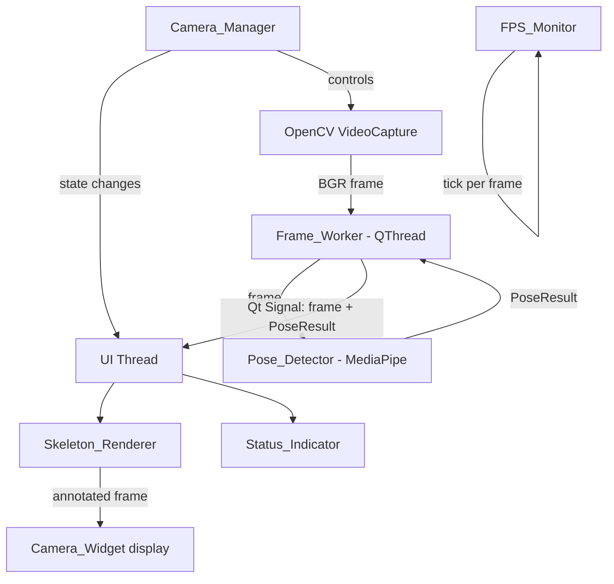
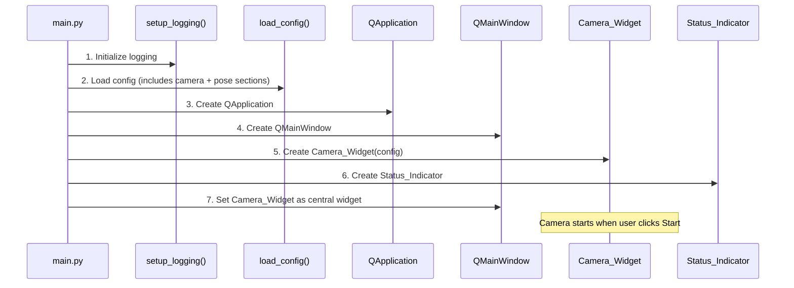
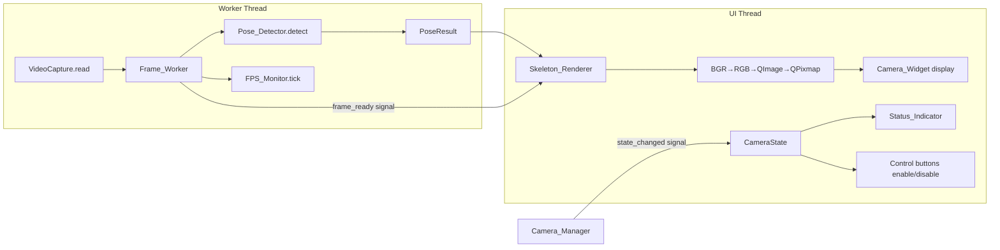

# Design Document: Camera Capture & Real-Time Pose Detection Pipeline (Phase 1)

## Overview

This design specifies Phase 1 of OpenDance AI — the camera capture, real-time pose detection, and skeleton visualization pipeline. Phase 1 builds on the Phase 0 foundation (configuration system, logging, PySide6 entry point) to deliver:

- Camera discovery, initialization, and lifecycle management via `Camera_Manager`
- Non-blocking frame acquisition on a QThread-based `Frame_Worker`
- Real-time MediaPipe Pose Landmarker inference producing structured `PoseResult` data
- FPS measurement using a rolling-window `FPS_Monitor`
- Skeleton overlay rendering via `Skeleton_Renderer` (respects visibility threshold)
- Live camera feed display in `Camera_Widget` with start/stop controls and `Status_Indicator`
- Configuration extensions (`CameraConfig`, `PoseConfig`) integrated with the existing TOML config system
- Graceful error handling and resource cleanup on stop/shutdown

**Explicit scope boundary:** Phase 1 does NOT implement pose normalization, reference video loading, motion feature extraction, temporal alignment, scoring, grading, Practice mode, or Arcade mode. The pipeline terminates at raw pose detection + skeleton visualization.

**Privacy:** All processing is strictly local. No frames are transmitted over the network, persisted to disk, or logged.

## Architecture

### High-Level Data Flow



### Component Ownership

```
Camera Layer (src/opendance/camera/)
├── Camera_Manager      — lifecycle, state machine, VideoCapture control
├── Camera_State        — enum (inactive, active, paused, error)
├── Frame_Worker        — QThread worker, frame acquisition + pose detection loop
└── FPS_Monitor         — rolling-window FPS measurement

Pose Layer (src/opendance/pose/)
├── Pose_Detector       — MediaPipe PoseLandmarker initialization + inference
├── Pose_Result         — structured detection output dataclass
└── Landmark            — per-landmark data (coords, visibility, confidence)

UI Layer (src/opendance/ui/)
├── Camera_Widget       — QWidget displaying live feed, start/stop controls
├── Status_Indicator    — QLabel showing Camera_State in human-readable form
└── Skeleton_Renderer   — draws landmarks + bones onto frame (pure function)

Configuration Layer (src/opendance/config/)
├── CameraConfig        — frozen dataclass for [camera] section
├── PoseConfig          — frozen dataclass for [pose] section
└── AppConfig (extended) — adds camera_config, pose_config fields
```

### Initialization Sequence



### Threading Model

| Thread | Responsibilities |
|--------|-----------------|
| **Main/UI thread** | Qt event loop, widget rendering, signal handling, Skeleton_Renderer (fast draw on received frame) |
| **Frame_Worker thread (QThread)** | `VideoCapture.read()`, `Pose_Detector.detect()`, FPS tick, emit signal with (frame, PoseResult) |

The Frame_Worker is a `QThread` subclass (or `QObject` moved to a `QThread`). It runs a tight loop:

```
while self._running:
    ok, frame = self._capture.read()
    if not ok:
        handle_failure()
        continue
    self._fps_monitor.tick()
    pose_result = self._pose_detector.detect(frame)
    self.frame_ready.emit(frame, pose_result)  # Qt signal → UI thread
```

All heavy I/O and inference happens on this thread. The UI thread only receives finished results via signal.

## Components and Interfaces

### 1. Camera State (`src/opendance/camera/state.py`)

```python
from enum import Enum, auto


class CameraState(Enum):
    """Operational states for the camera subsystem."""
    INACTIVE = auto()
    ACTIVE = auto()
    PAUSED = auto()
    ERROR = auto()
```

### 2. Camera Manager (`src/opendance/camera/manager.py`)

```python
from PySide6.QtCore import QObject, Signal
from opendance.camera.state import CameraState
from opendance.config.models import CameraConfig


class CameraManager(QObject):
    """Manages camera lifecycle: discovery, open, state transitions, cleanup.

    Signals:
        state_changed(CameraState, str): Emitted on every state transition.
            The str is the error description (empty string if no error).
    """

    state_changed = Signal(CameraState, str)

    def __init__(self, config: CameraConfig, parent: QObject | None = None) -> None: ...

    @property
    def state(self) -> CameraState: ...

    @property
    def error_message(self) -> str: ...

    def start(self) -> None:
        """Discover and open camera. Transitions INACTIVE → ACTIVE or → ERROR."""
        ...

    def pause(self) -> None:
        """Suspend frame acquisition. Transitions ACTIVE → PAUSED."""
        ...

    def resume(self) -> None:
        """Resume frame acquisition. Transitions PAUSED → ACTIVE."""
        ...

    def stop(self) -> None:
        """Stop camera and release resources. Any state → INACTIVE."""
        ...

    def cleanup(self) -> None:
        """Release all resources. Called on application shutdown."""
        ...
```

**Design decisions:**
- `CameraManager` is a `QObject` to leverage Qt's signal mechanism for state change notifications.
- `start()` creates the `VideoCapture` with the configured `device_index`, attempts to set resolution, and spawns `Frame_Worker` if successful.
- `stop()` is idempotent — safe to call from any state.
- The consecutive-failure threshold is held in `CameraConfig` and passed to `Frame_Worker`.

### 3. Frame Worker (`src/opendance/camera/frame_worker.py`)

```python
import numpy as np
from PySide6.QtCore import QThread, Signal
from opendance.camera.fps_monitor import FPSMonitor
from opendance.pose.detector import PoseDetector
from opendance.pose.result import PoseResult


class FrameWorker(QThread):
    """Background thread: acquires frames, runs pose detection, emits results.

    Signals:
        frame_ready(np.ndarray, PoseResult): Emitted when a frame + pose result is available.
        error_occurred(str): Emitted when consecutive failures exceed threshold.
    """

    frame_ready = Signal(np.ndarray, PoseResult)
    error_occurred = Signal(str)

    def __init__(
        self,
        capture,  # cv2.VideoCapture (injected for testability)
        pose_detector: PoseDetector,
        fps_monitor: FPSMonitor,
        consecutive_failure_threshold: int = 10,
    ) -> None: ...

    def run(self) -> None:
        """Main acquisition loop. Runs until request_stop() is called."""
        ...

    def request_stop(self) -> None:
        """Signal the worker to exit its loop gracefully."""
        ...

    def pause(self) -> None:
        """Suspend frame acquisition without releasing resources."""
        ...

    def resume(self) -> None:
        """Resume frame acquisition from paused state."""
        ...
```

**Design decisions:**
- `FrameWorker` inherits `QThread` and overrides `run()`.
- The `capture` (VideoCapture) is injected rather than created internally, enabling test substitution with mock/synthetic sources.
- On each failed `capture.read()`, a consecutive failure counter increments. When it reaches the threshold, `error_occurred` is emitted and the loop exits.
- On success, the counter resets to zero.
- `pause()` / `resume()` use a threading event to suspend/resume the loop without destroying the thread.

### 4. FPS Monitor (`src/opendance/camera/fps_monitor.py`)

```python
import time
from collections import deque


class FPSMonitor:
    """Measures actual frame acquisition rate using a rolling window.

    Uses a fixed-size deque of timestamps. FPS = (window_size - 1) / (newest - oldest).
    """

    def __init__(self, window_size: int = 30) -> None:
        self._timestamps: deque[float] = deque(maxlen=window_size)

    def tick(self) -> None:
        """Record a frame acquisition timestamp."""
        self._timestamps.append(time.perf_counter())

    @property
    def fps(self) -> float:
        """Return current FPS based on rolling window. Returns 0.0 if insufficient data."""
        if len(self._timestamps) < 2:
            return 0.0
        elapsed = self._timestamps[-1] - self._timestamps[0]
        if elapsed <= 0.0:
            return 0.0
        return (len(self._timestamps) - 1) / elapsed

    def reset(self) -> None:
        """Clear all timestamps."""
        self._timestamps.clear()
```

**Design decisions:**
- Rolling window of 30 timestamps (~1 second at 30fps) provides responsive FPS measurement.
- `deque(maxlen=N)` automatically discards old timestamps — O(1) per tick.
- No locks needed because `FPSMonitor` is only accessed from the worker thread.

### 5. Pose Detector (`src/opendance/pose/detector.py`)

```python
import numpy as np
from opendance.config.models import PoseConfig
from opendance.pose.result import PoseResult


class PoseDetector:
    """Wraps MediaPipe Pose Landmarker: one-time init, reuse for all frames.

    The detector uses VIDEO running mode for sequential frame processing.
    """

    def __init__(self, config: PoseConfig) -> None:
        """Initialize MediaPipe PoseLandmarker from the configured model path.

        Raises FileNotFoundError if model file does not exist.
        """
        ...

    def detect(self, frame: np.ndarray, timestamp_ms: int = 0) -> PoseResult:
        """Run pose detection on a BGR frame. Returns PoseResult (possibly empty).

        Never raises on detection failure — returns PoseResult.empty().
        """
        ...

    def close(self) -> None:
        """Release MediaPipe resources."""
        ...
```

**Design decisions:**
- Uses `RunningMode.VIDEO` (synchronous, sequential frames with increasing timestamps). This is appropriate for the worker thread processing frames one at a time.
- `RunningMode.LIVE_STREAM` was considered but rejected because it requires a callback and can drop frames. Since we control the acquisition loop, VIDEO mode gives deterministic results per frame.
- `detect()` converts BGR→RGB, wraps in `mp.Image`, calls `detect_for_video()`, and translates the MediaPipe result into our `PoseResult` dataclass.
- `detect()` catches all MediaPipe exceptions and returns `PoseResult.empty()` — the pipeline never crashes from a detection failure.
- The model is initialized once in `__init__` and reused for the lifetime of the detector.

### 6. Pose Result Data Structures (`src/opendance/pose/result.py`)

```python
from dataclasses import dataclass, field
import numpy as np


@dataclass(frozen=True)
class Landmark:
    """Single landmark with image-space coordinates and metadata.

    Attributes:
        x: Normalized x coordinate [0.0, 1.0] (image-space).
        y: Normalized y coordinate [0.0, 1.0] (image-space).
        z: Normalized z coordinate (depth relative to hip midpoint).
        visibility: Likelihood the landmark is visible in the image [0.0, 1.0].
        presence: Confidence that the landmark exists on the person [0.0, 1.0].
    """
    x: float
    y: float
    z: float
    visibility: float
    presence: float


@dataclass(frozen=True)
class WorldLandmark:
    """Single landmark in real-world 3D coordinates (meters, hip-centered).

    Attributes:
        x: X position in meters.
        y: Y position in meters.
        z: Z position in meters.
        visibility: Same as Landmark.visibility.
        presence: Same as Landmark.presence.
    """
    x: float
    y: float
    z: float
    visibility: float
    presence: float


@dataclass(frozen=True)
class PoseResult:
    """Structured output of a single pose detection.

    Attributes:
        landmarks: Normalized image-space landmarks (33 for full body).
            Empty tuple if no pose detected.
        world_landmarks: World-space landmarks in meters (33 for full body).
            Empty tuple if no pose detected or world data unavailable.
        timestamp_ms: Frame timestamp in milliseconds.
    """
    landmarks: tuple[Landmark, ...] = field(default_factory=tuple)
    world_landmarks: tuple[WorldLandmark, ...] = field(default_factory=tuple)
    timestamp_ms: int = 0

    @property
    def is_empty(self) -> bool:
        """True if no pose was detected."""
        return len(self.landmarks) == 0

    @staticmethod
    def empty(timestamp_ms: int = 0) -> "PoseResult":
        """Factory for an empty result (no detection)."""
        return PoseResult(landmarks=(), world_landmarks=(), timestamp_ms=timestamp_ms)
```

**Design decisions:**
- Frozen dataclasses ensure immutability — safe to pass across threads via signal.
- `tuple` rather than `list` reinforces immutability and is hashable.
- Landmark indices follow MediaPipe's 33-landmark scheme (NOSE=0, LEFT_EYE_INNER=1, ..., RIGHT_FOOT_INDEX=32). An enum or constant module can map index → name, but the ordering is implicit by position.
- Visibility and presence (confidence) are separate fields matching MediaPipe's output.
- `WorldLandmark` provides meter-space hip-centered coordinates for future phases.

### 7. Skeleton Renderer (`src/opendance/ui/skeleton_renderer.py`)

```python
import numpy as np
from opendance.pose.result import PoseResult


# MediaPipe Pose bone connections (pairs of landmark indices)
POSE_CONNECTIONS: list[tuple[int, int]] = [
    (0, 1), (1, 2), (2, 3), (3, 7),    # left eye chain
    (0, 4), (4, 5), (5, 6), (6, 8),    # right eye chain
    (9, 10),                             # mouth
    (11, 12),                            # shoulders
    (11, 13), (13, 15),                  # left arm
    (12, 14), (14, 16),                  # right arm
    (11, 23), (12, 24), (23, 24),        # torso
    (23, 25), (25, 27),                  # left leg
    (24, 26), (26, 28),                  # right leg
    (27, 29), (29, 31), (31, 27),        # left foot
    (28, 30), (30, 32), (32, 28),        # right foot
    (15, 17), (15, 19), (15, 21),        # left hand
    (16, 18), (16, 20), (16, 22),        # right hand
]


def render_skeleton(
    frame: np.ndarray,
    pose_result: PoseResult,
    visibility_threshold: float = 0.5,
    landmark_color: tuple[int, int, int] = (0, 255, 0),
    connection_color: tuple[int, int, int] = (0, 200, 0),
    landmark_radius: int = 4,
    connection_thickness: int = 2,
) -> np.ndarray:
    """Draw skeleton overlay on frame. Returns the annotated frame.

    If pose_result is empty, returns the frame unmodified.
    Only draws landmarks with visibility >= visibility_threshold.
    Bone connections drawn only when both endpoints meet the threshold.
    """
    ...
```

**Design decisions:**
- Pure function (no class state needed) — easy to test in isolation.
- Operates on the frame in-place for performance (avoids copy) but also returns it for chaining.
- The visibility threshold is passed as a parameter (sourced from `PoseConfig.skeleton_visibility_threshold`).
- Uses OpenCV `cv2.circle()` and `cv2.line()` for drawing — no additional dependencies.

### 8. Camera Widget (`src/opendance/ui/camera_widget.py`)

```python
import numpy as np
from PySide6.QtCore import Slot
from PySide6.QtGui import QImage, QPixmap
from PySide6.QtWidgets import QWidget, QVBoxLayout, QHBoxLayout, QLabel, QPushButton

from opendance.camera.manager import CameraManager
from opendance.camera.state import CameraState
from opendance.pose.result import PoseResult
from opendance.ui.skeleton_renderer import render_skeleton
from opendance.ui.status_indicator import StatusIndicator


class CameraWidget(QWidget):
    """Main camera display widget with controls and status.

    Layout:
    ┌─────────────────────────────┐
    │      Camera Feed (QLabel)    │
    │    (scaled, aspect ratio)    │
    ├─────────────────────────────┤
    │  [Start] [Stop]  | Status   │
    └─────────────────────────────┘
    """

    def __init__(self, camera_manager: CameraManager, config, parent=None) -> None: ...

    @Slot(np.ndarray, PoseResult)
    def _on_frame_ready(self, frame: np.ndarray, pose_result: PoseResult) -> None:
        """Handle frame+pose from worker: render skeleton, convert, display."""
        ...

    @Slot(CameraState, str)
    def _on_state_changed(self, state: CameraState, error_msg: str) -> None:
        """Update controls and status indicator based on new state."""
        ...

    def _start_camera(self) -> None:
        """Slot for Start button click."""
        ...

    def _stop_camera(self) -> None:
        """Slot for Stop button click."""
        ...
```

**Frame display pipeline (UI thread, triggered by signal):**
1. Receive `(frame, pose_result)` from `FrameWorker.frame_ready` signal
2. Call `render_skeleton(frame, pose_result, threshold)` — fast, modifies frame in-place
3. Convert BGR `np.ndarray` → `QImage(data, w, h, stride, Format_RGB888)` after `cv2.cvtColor(frame, COLOR_BGR2RGB)`
4. Create `QPixmap.fromImage(qimage)`
5. Scale pixmap to fit `QLabel` size with `Qt.KeepAspectRatio`
6. Set on display label: `self._display.setPixmap(scaled)`

**Control state logic:**
- Start button enabled when `state in {INACTIVE, ERROR}`
- Stop button enabled when `state in {ACTIVE, PAUSED}`
- When inactive: display label shows placeholder text or blank
- When paused: last pixmap remains displayed (frozen)

### 9. Status Indicator (`src/opendance/ui/status_indicator.py`)

```python
from PySide6.QtWidgets import QLabel
from opendance.camera.state import CameraState


class StatusIndicator(QLabel):
    """Displays human-readable camera status."""

    _STATE_MESSAGES: dict[CameraState, str] = {
        CameraState.INACTIVE: "Camera not running",
        CameraState.ACTIVE: "Camera active",
        CameraState.PAUSED: "Camera paused",
        CameraState.ERROR: "",  # Uses dynamic error message
    }

    def update_state(self, state: CameraState, error_message: str = "") -> None:
        """Update displayed text based on camera state."""
        if state == CameraState.ERROR:
            self.setText(error_message or "Camera error")
        else:
            self.setText(self._STATE_MESSAGES.get(state, "Unknown state"))
```

### 10. Integration with Phase 0 Main Window

The existing `main.py` is extended to instantiate the camera pipeline components:

```python
def main() -> int:
    # ... existing logging + config init ...

    app = QApplication(sys.argv)
    window = QMainWindow()
    window.setWindowTitle("OpenDance AI")
    window.setMinimumSize(800, 600)

    # Phase 1: Create camera pipeline
    camera_manager = CameraManager(config.camera_config)
    camera_widget = CameraWidget(camera_manager, config)
    window.setCentralWidget(camera_widget)

    # Cleanup on application quit
    app.aboutToQuit.connect(camera_manager.cleanup)

    window.show()
    return app.exec()
```

**Design decisions:**
- `Camera_Widget` becomes the central widget, replacing Phase 0's bare `QMainWindow`.
- `app.aboutToQuit` signal ensures cleanup runs on application close regardless of how the window is closed.
- `CameraManager` does NOT auto-start on construction. The user clicks "Start" to begin.

## Data Models

### Configuration Extensions

#### New Dataclasses (`src/opendance/config/models.py`)

```python
@dataclass(frozen=True)
class CameraConfig:
    """Camera subsystem configuration."""
    device_index: int = 0
    resolution_width: int = 640
    resolution_height: int = 480
    consecutive_failure_threshold: int = 10


@dataclass(frozen=True)
class PoseConfig:
    """Pose detection configuration."""
    model_path: str = "assets/models/pose_landmarker.task"
    skeleton_visibility_threshold: float = 0.5


@dataclass(frozen=True)
class AppConfig:
    """Top-level application configuration (extended for Phase 1)."""
    scoring_thresholds: ScoringThresholds = field(default_factory=ScoringThresholds)
    scoring_weights: ScoringWeights = field(default_factory=ScoringWeights)
    camera_config: CameraConfig = field(default_factory=CameraConfig)
    pose_config: PoseConfig = field(default_factory=PoseConfig)
```

#### Extended `defaults.toml`

```toml
[scoring.thresholds]
perfect_min = 90.0
great_min = 75.0
ok_min = 50.0
meh_min = 30.0

[scoring.weights]
pose_similarity = 0.40
angle_similarity = 0.25
motion_similarity = 0.20
timing_similarity = 0.15

[camera]
device_index = 0
resolution_width = 640
resolution_height = 480
consecutive_failure_threshold = 10

[pose]
model_path = "assets/models/pose_landmarker.task"
skeleton_visibility_threshold = 0.5
```

#### Validation Ranges

| Field | Type | Range |
|-------|------|-------|
| `camera.device_index` | int | >= 0 |
| `camera.resolution_width` | int | > 0 |
| `camera.resolution_height` | int | > 0 |
| `camera.consecutive_failure_threshold` | int | >= 1 |
| `pose.model_path` | str | non-empty string |
| `pose.skeleton_visibility_threshold` | float | [0.0, 1.0] |

### Complete Data Flow Diagram



### File Structure Summary

```
src/opendance/
├── camera/
│   ├── __init__.py          # exports: CameraManager, CameraState, FrameWorker, FPSMonitor
│   ├── state.py             # CameraState enum
│   ├── manager.py           # CameraManager class
│   ├── frame_worker.py      # FrameWorker QThread
│   └── fps_monitor.py       # FPSMonitor class
├── pose/
│   ├── __init__.py          # exports: PoseDetector, PoseResult, Landmark, WorldLandmark
│   ├── detector.py          # PoseDetector (MediaPipe wrapper)
│   └── result.py            # PoseResult, Landmark, WorldLandmark dataclasses
├── ui/
│   ├── __init__.py          # exports: CameraWidget, StatusIndicator, render_skeleton
│   ├── camera_widget.py     # CameraWidget (main display + controls)
│   ├── status_indicator.py  # StatusIndicator QLabel
│   └── skeleton_renderer.py # render_skeleton function + POSE_CONNECTIONS
├── config/
│   ├── models.py            # Extended: adds CameraConfig, PoseConfig to AppConfig
│   ├── defaults.toml        # Extended: adds [camera] and [pose] sections
│   ├── loader.py            # Extended: validates + builds CameraConfig, PoseConfig
│   └── __init__.py          # Extended exports
├── app/
│   └── main.py              # Extended: creates Camera_Widget as central widget
└── logging_setup.py         # Unchanged from Phase 0
```

## Correctness Properties

*A property is a characteristic or behavior that should hold true across all valid executions of a system — essentially, a formal statement about what the system should do. Properties serve as the bridge between human-readable specifications and machine-verifiable correctness guarantees.*

### Property 1: Camera initialization uses configured device index

*For any* non-negative integer `device_index` provided via `CameraConfig`, when `CameraManager.start()` is called, the system SHALL attempt to open `VideoCapture(device_index)` with that exact index.

**Validates: Requirements 1.1, 1.5**

### Property 2: Successful camera open transitions to active with notification

*For any* camera open attempt that succeeds (VideoCapture.isOpened() returns True), `CameraManager` SHALL transition `CameraState` to `ACTIVE` AND emit `state_changed(ACTIVE, "")`.

**Validates: Requirements 1.2, 3.2, 3.7**

### Property 3: Stop from any state transitions to inactive with cleanup and notification

*For any* `CameraState` value, calling `CameraManager.stop()` SHALL transition state to `INACTIVE`, release `VideoCapture`, terminate `FrameWorker` thread, AND emit `state_changed(INACTIVE, "")`.

**Validates: Requirements 3.5, 3.7, 11.1, 11.2**

### Property 4: Consecutive failure threshold triggers error state

*For any* positive integer threshold `N` configured as `consecutive_failure_threshold`, if `VideoCapture.read()` fails for `N` consecutive attempts, the system SHALL transition to `ERROR` state. If fewer than `N` consecutive failures occur (with at least one success resetting the count), the system SHALL NOT transition to `ERROR`.

**Validates: Requirements 5.2, 5.3, 5.5**

### Property 5: PoseResult structural completeness

*For any* frame where MediaPipe detects a pose, the resulting `PoseResult` SHALL contain exactly 33 `Landmark` entries (matching MediaPipe's landmark indices), each with `x`, `y`, `z` floats, a `visibility` float in [0.0, 1.0], and a `presence` float in [0.0, 1.0]. Additionally, `world_landmarks` SHALL contain 33 `WorldLandmark` entries with `x`, `y`, `z` in meters.

**Validates: Requirements 7.5, 7.6, 7.7, 8.1, 8.2, 8.4, 8.5**

### Property 6: Pose detection produces valid result for any frame without exception

*For any* valid numpy ndarray representing a BGR image (any dimensions ≥ 1×1, any pixel content), `PoseDetector.detect()` SHALL return a `PoseResult` (possibly empty) without raising an unhandled exception.

**Validates: Requirements 7.4, 7.8**

### Property 7: Skeleton rendering respects visibility threshold

*For any* `PoseResult` with landmarks and *for any* visibility threshold `t` in [0.0, 1.0], `render_skeleton` SHALL draw a landmark point if and only if that landmark's `visibility >= t`. A bone connection SHALL be drawn if and only if BOTH endpoint landmarks have `visibility >= t`.

**Validates: Requirements 9.1, 9.2, 9.3**

### Property 8: FPS rolling window reflects recent frame rate

*For any* sequence of monotonically increasing timestamps fed to `FPSMonitor.tick()`, the reported `fps` SHALL equal `(window_count - 1) / (newest_timestamp - oldest_timestamp)` where `window_count` is `min(tick_count, window_size)`. When the rate changes, the reported FPS SHALL converge to the new rate within one window period.

**Validates: Requirements 4.1, 4.3**

### Property 9: Frame display preserves aspect ratio with correct color conversion

*For any* BGR frame of dimensions `(h, w, 3)` and *for any* widget display area `(dw, dh)`, the displayed pixmap dimensions SHALL satisfy: `display_w / display_h ≈ w / h` (aspect ratio preserved) AND pixel values SHALL correspond to the BGR→RGB conversion of the input frame.

**Validates: Requirements 12.2, 12.3**

### Property 10: UI control state reflects Camera_State

*For any* `CameraState` value: the Start control SHALL be enabled if and only if `state in {INACTIVE, ERROR}`, and the Stop control SHALL be enabled if and only if `state in {ACTIVE, PAUSED}`.

**Validates: Requirements 6.5, 6.6**

### Property 11: Repeated start/stop cycles do not leak resources

*For any* positive integer `N`, performing `N` sequential start/stop cycles SHALL result in exactly `N` `VideoCapture.release()` calls and zero threads remaining alive after the final stop.

**Validates: Requirements 11.1, 11.2, 11.5**

### Property 12: Camera and pose configuration validation and merge

*For any* user-provided TOML override for `[camera]` or `[pose]` sections, values that fail type validation or range validation SHALL be replaced by the default value (with a warning logged), and valid partial overrides SHALL merge correctly (unspecified keys retain defaults).

**Validates: Requirements 15.4, 15.5**

## Error Handling

### Camera Errors

| Error Condition | Detection | Response | User Impact |
|----------------|-----------|----------|-------------|
| No camera device found | `VideoCapture.isOpened()` returns False | Transition to ERROR, emit state_changed | Status shows "No camera found" |
| Camera fails to open at device index | `VideoCapture.isOpened()` returns False | Transition to ERROR, emit state_changed | Status shows "Could not open camera" |
| Camera disconnected mid-operation | `VideoCapture.read()` returns `(False, None)` repeatedly | Consecutive failure counter increments; at threshold → ERROR | Status shows "Camera disconnected" |
| Single frame read failure | `VideoCapture.read()` returns False | Log warning, increment counter, continue loop | No user impact (brief glitch) |
| Resolution not supported | Set resolution → read actual differs | Log warning, use camera's default resolution | No user impact (resolution may differ) |

### Pose Detection Errors

| Error Condition | Detection | Response | User Impact |
|----------------|-----------|----------|-------------|
| Model file not found | `FileNotFoundError` in `PoseDetector.__init__` | Raise to caller (Camera_Manager won't start) | Status shows "Pose model not found" |
| No body detected in frame | MediaPipe returns empty result | Return `PoseResult.empty()` | Frame displayed without skeleton |
| MediaPipe inference error | Exception in `detect_for_video()` | Catch, log, return `PoseResult.empty()` | Frame displayed without skeleton |

### Resource Cleanup Errors

| Error Condition | Detection | Response |
|----------------|-----------|----------|
| `VideoCapture.release()` raises | Exception in cleanup | Log error, continue cleanup |
| `FrameWorker` thread won't terminate | `wait(timeout)` returns False | Log warning, force-terminate is NOT used (let OS reclaim) |
| `PoseLandmarker.close()` raises | Exception in cleanup | Log error, continue cleanup |

### Graceful Degradation Strategy

1. **Camera failure → UI remains responsive.** Error state is shown via Status_Indicator; Start button becomes available for retry.
2. **Pose detection failure → Frame still displayed.** User sees their camera feed without skeleton overlay.
3. **Configuration failure → Defaults used.** Same Phase 0 pattern: invalid config values fall back to defaults.
4. **No exceptions escape to the user.** All exceptions are caught at component boundaries and converted to state transitions or empty results.

## Testing Strategy

### Testing Approach

Phase 1 uses a **dual testing approach**:
- **Property-based tests** (via `hypothesis`) verify universal properties across randomized inputs
- **Example-based unit tests** (via `pytest`) verify specific scenarios, state transitions, and edge cases

Property-based testing is appropriate for Phase 1 because:
- FPS calculation, skeleton rendering, frame conversion, and config validation are pure functions with clear input/output behavior
- State machine transitions have universal rules that should hold for all inputs
- The input space is large (arbitrary frames, arbitrary landmark coordinates, arbitrary timestamps)

### Property-Based Testing Configuration

- **Library:** `hypothesis` (added to `[project.optional-dependencies] dev`)
- **Minimum iterations:** 100 per property test (via `@settings(max_examples=100)`)
- **Tag format:** Comment above each test: `# Feature: camera-pose-pipeline, Property N: <title>`

### Test Plan

| Module | Test File | Test Type | Coverage |
|--------|-----------|-----------|----------|
| CameraState | `tests/unit/test_camera_state.py` | Example | Enum members, transitions |
| CameraManager | `tests/unit/test_camera_manager.py` | Property + Example | State machine, lifecycle |
| FrameWorker | `tests/unit/test_frame_worker.py` | Property + Example | Failure counting, signal emission |
| FPSMonitor | `tests/unit/test_fps_monitor.py` | Property | Rolling window calculation |
| PoseDetector | `tests/unit/test_pose_detector.py` | Property + Example | Detection, error handling |
| PoseResult | `tests/unit/test_pose_result.py` | Property | Structure, factory methods |
| SkeletonRenderer | `tests/unit/test_skeleton_renderer.py` | Property | Visibility threshold, drawing |
| CameraWidget | `tests/unit/test_camera_widget.py` | Property + Example | Display, controls, conversion |
| StatusIndicator | `tests/unit/test_status_indicator.py` | Example | Message display per state |
| CameraConfig/PoseConfig | `tests/unit/test_config.py` (extended) | Property | Validation, merge |

### Mocking Strategy (No Hardware Required)

| Dependency | Mock Approach |
|------------|--------------|
| `cv2.VideoCapture` | Mock class returning synthetic frames (`np.zeros((480, 640, 3), dtype=np.uint8)`) or failure |
| `mediapipe.tasks.vision.PoseLandmarker` | Mock returning predefined `PoseLandmarkerResult` with known landmarks |
| Qt display | `QT_QPA_PLATFORM=offscreen` for headless widget tests |
| Physical camera | Never used in unit tests; integration tests with real camera are separate/manual |

### Synthetic Test Data

- **Frames:** NumPy arrays of known dimensions and pixel values (e.g., solid color, gradient, random)
- **Landmarks:** Generated with `hypothesis` strategies producing floats in [0.0, 1.0] for coordinates and visibility
- **Timestamps:** Monotonically increasing sequences generated by hypothesis

### CI Configuration

The existing `.github/workflows/ci.yml` already sets `QT_QPA_PLATFORM: offscreen`. Phase 1 tests require:
- No camera hardware (all mocked)
- No GPU (MediaPipe CPU inference, or mocked entirely in unit tests)
- `hypothesis` added to dev dependencies

### What Phase 1 Tests Verify

1. Camera state machine transitions for all valid paths
2. Consecutive failure threshold behavior (parameterized by threshold value)
3. FPS calculation correctness for various timing patterns
4. PoseResult structure completeness and immutability
5. Skeleton renderer visibility filtering correctness
6. Frame BGR→RGB conversion and aspect-ratio scaling
7. UI control enable/disable state for all camera states
8. Resource cleanup (release called, thread terminated) on stop
9. Start/stop cycle resource integrity
10. Configuration validation for camera and pose sections
11. Error handling: no unhandled exceptions escape components

### What Phase 1 Tests Do NOT Cover

- Real camera hardware interaction (manual/integration test only)
- MediaPipe model accuracy or inference quality
- Actual frame rates or performance benchmarks
- UI visual appearance or layout pixel-perfection
- Network behavior (no network access in Phase 1)
