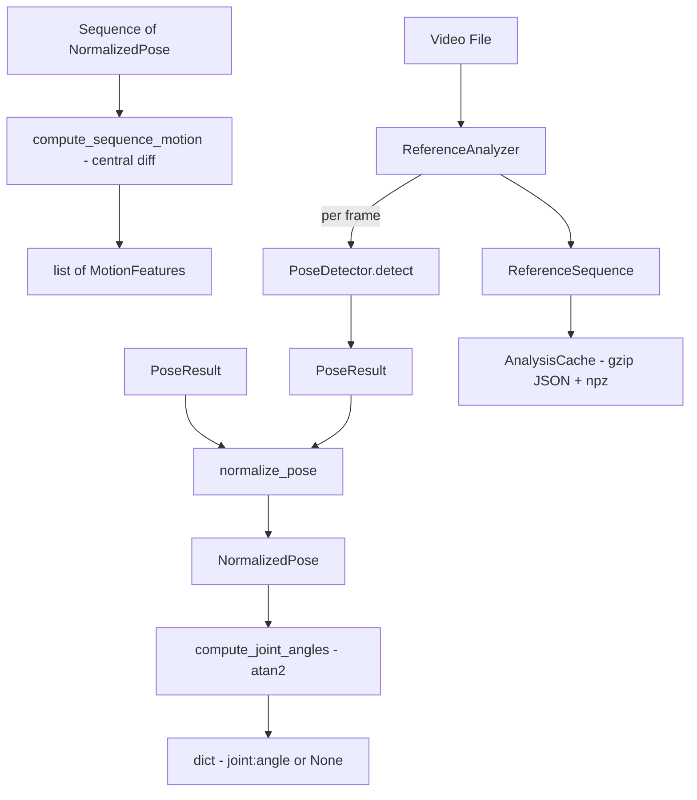

# Design Document: Pose Normalization & Motion Features (Phase 2)

## Overview

Phase 2 transforms raw `PoseResult` data from Phase 1 into body-relative normalized coordinates, computes signed joint angles (atan2), motion dynamics via central differences, and provides reference video analysis with a deterministic gzipped-JSON + numpy cache. New modules live in `src/opendance/motion/` and `src/opendance/video/`. Phase 1 code is consumed unchanged.

**Phase 1 API consumed (NOT modified):**
```python
@dataclass(frozen=True)
class Landmark:
    x: float; y: float; z: float; visibility: float; presence: float

@dataclass(frozen=True)
class WorldLandmark:
    x: float; y: float; z: float; visibility: float; presence: float

@dataclass(frozen=True)
class PoseResult:
    landmarks: tuple[Landmark, ...]       # 33 image-space
    world_landmarks: tuple[WorldLandmark, ...]  # 33 world-space (meters)
    timestamp_ms: int

class PoseDetector:
    def detect(self, frame: np.ndarray, timestamp_ms: int = 0) -> PoseResult: ...
```

## Architecture

### File Structure

```
src/opendance/
├── motion/
│   ├── __init__.py
│   ├── landmarks.py          # Index constants + joint definitions
│   ├── normalizer.py         # normalize_pose() pure function
│   ├── normalized_pose.py    # NormalizedPose dataclass
│   ├── angles.py             # compute_joint_angles() — signed atan2
│   ├── features.py           # compute_sequence_motion() — central differences
│   └── motion_result.py      # MotionFeatures, LandmarkMotion dataclasses
├── video/
│   ├── __init__.py
│   ├── reference_analyzer.py # ReferenceAnalyzer class
│   ├── reference_sequence.py # ReferenceSequence, VideoMetadata
│   └── analysis_cache.py     # AnalysisCache (gzip JSON + numpy)
├── config/
│   ├── models.py             # +NormalizationConfig, +MotionConfig, +ReferenceConfig
│   ├── defaults.toml         # +[normalization], +[motion], +[reference]
│   └── loader.py             # Extended validation
└── pose/                     # UNCHANGED
```

### Data Flow



## Components and Interfaces

### 1. Landmark Index Constants (`src/opendance/motion/landmarks.py`)

```python
# 33 MediaPipe Pose landmark constants
NOSE = 0
LEFT_EYE_INNER = 1
# ... (all 33)
LEFT_HIP = 23
RIGHT_HIP = 24
LEFT_SHOULDER = 11
RIGHT_FOOT_INDEX = 32

# Joint angle definitions: (proximal, joint, distal)
JOINT_ANGLES: dict[str, tuple[int, int, int]] = {
    "left_elbow": (LEFT_SHOULDER, LEFT_ELBOW, LEFT_WRIST),
    "right_elbow": (RIGHT_SHOULDER, RIGHT_ELBOW, RIGHT_WRIST),
    "left_shoulder": (LEFT_ELBOW, LEFT_SHOULDER, LEFT_HIP),
    "right_shoulder": (RIGHT_ELBOW, RIGHT_SHOULDER, RIGHT_HIP),
    "left_knee": (LEFT_HIP, LEFT_KNEE, LEFT_ANKLE),
    "right_knee": (RIGHT_HIP, RIGHT_KNEE, RIGHT_ANKLE),
    "left_hip": (LEFT_KNEE, LEFT_HIP, LEFT_SHOULDER),
    "right_hip": (RIGHT_KNEE, RIGHT_HIP, RIGHT_SHOULDER),
}

BODY_CENTER_LANDMARKS = (LEFT_HIP, RIGHT_HIP)
BODY_SCALE_LANDMARKS = (LEFT_SHOULDER, RIGHT_HIP)
```

### 2. NormalizedPose (`src/opendance/motion/normalized_pose.py`)

```python
from dataclasses import dataclass, field
import numpy as np


@dataclass(frozen=True)
class NormalizedPose:
    """Body-relative pose after translation/scale removal.

    Attributes:
        timestamp_ms: Authoritative frame timestamp from PoseResult.
        landmarks_2d: (33, 3) float array or None entries. Body-normalized image-space.
        landmarks_3d: (33, 3) float array or None entries. Body-normalized world-space.
            None if world landmarks were unavailable.
        visibilities: tuple of 33 floats (original Landmark.visibility values).
        presences: tuple of 33 floats (original Landmark.presence values).
        body_center: (3,) float array — the computed center before normalization.
        body_scale: float — the scale divisor used.
        valid: bool — False if normalization could not be performed.
    """
    timestamp_ms: int
    landmarks_2d: tuple[tuple[float, float, float] | None, ...]  # 33 entries
    landmarks_3d: tuple[tuple[float, float, float] | None, ...] | None  # 33 or None
    visibilities: tuple[float, ...]  # 33 original values
    presences: tuple[float, ...]     # 33 original values
    body_center: tuple[float, float, float]
    body_scale: float
    valid: bool

    @staticmethod
    def invalid(timestamp_ms: int = 0) -> "NormalizedPose":
        """Factory for a failed normalization result."""
        return NormalizedPose(
            timestamp_ms=timestamp_ms,
            landmarks_2d=tuple(None for _ in range(33)),
            landmarks_3d=None,
            visibilities=tuple(0.0 for _ in range(33)),
            presences=tuple(0.0 for _ in range(33)),
            body_center=(0.0, 0.0, 0.0),
            body_scale=0.0,
            valid=False,
        )
```

### 3. Normalizer (`src/opendance/motion/normalizer.py`)

```python
from opendance.config.models import NormalizationConfig
from opendance.motion.normalized_pose import NormalizedPose
from opendance.pose.result import PoseResult


def normalize_pose(pose_result: PoseResult, config: NormalizationConfig) -> NormalizedPose:
    """Pure single-frame normalization. No temporal interpolation.

    Algorithm:
    1. Select coordinate space: world_landmarks preferred if landmarks 23,24,11
       have visibility >= threshold; else fall back to image-space landmarks.
    2. Compute body_center = midpoint(hip_left, hip_right).
       - If both hips unreliable → return invalid.
       - If one hip unreliable → use the available hip as approximate center.
    3. Compute body_scale = distance(left_shoulder, right_hip).
       - If either unreliable → return invalid.
       - If scale < min_body_scale → return invalid.
    4. For each landmark:
       - If visibility < threshold → None (leave_none strategy).
       - Else → (coord - body_center) / body_scale.
    5. Repeat for 3D world landmarks (if available) → landmarks_3d.
    6. Preserve original visibilities and presences unchanged.
    """
    ...
```

**Design decisions:**
- World-space preferred because it provides metric (meter) coordinates independent of camera intrinsics.
- When world coordinates produce body_scale in meters, dividing by it yields dimensionless body-normalized units — consistent regardless of whether source was world or image space.
- Pure function, no state, no temporal interpolation.

### 4. Joint Angles (`src/opendance/motion/angles.py`)

```python
import math
from opendance.motion.normalized_pose import NormalizedPose
from opendance.motion.landmarks import JOINT_ANGLES


def compute_joint_angles(
    normalized_pose: NormalizedPose,
    visibility_threshold: float = 0.5,
) -> dict[str, float | None]:
    """Compute signed joint angles using atan2(cross, dot).

    For each joint (proximal, joint_center, distal):
      BA = proximal - joint_center
      BC = distal - joint_center
      cross = BA.x * BC.y - BA.y * BC.x  (2D cross product magnitude)
      dot = BA · BC
      angle = atan2(cross, dot) * 180 / pi

    Output range: [-180, 180] degrees.
    Returns None for joints where any required landmark is None.

    Uses landmarks_3d when available, falls back to landmarks_2d.
    For 3D, cross product uses the z-component for the plane normal.
    """
    ...
```

**Design decision — signed angles via atan2:**
- `atan2(cross, dot)` preserves sign (direction of rotation), unlike `arccos` which only gives magnitude [0, 180].
- Signed angles allow distinguishing between flexion and extension, which is critical for motion comparison.
- For 2D: `cross = BA_x * BC_y - BA_y * BC_x`.
- For 3D: the cross product magnitude in the dominant plane is used.

### 5. Motion Features (`src/opendance/motion/features.py`)

```python
from dataclasses import dataclass
from opendance.motion.normalized_pose import NormalizedPose


@dataclass(frozen=True)
class LandmarkMotion:
    """Per-landmark motion for a single frame."""
    velocity_x: float | None
    velocity_y: float | None
    velocity_z: float | None
    speed: float | None           # |velocity|
    acceleration: float | None    # |a| or signed scalar
    direction_x: float | None     # unit vector
    direction_y: float | None
    direction_z: float | None


@dataclass(frozen=True)
class MotionFeatures:
    """Motion features for one frame in a sequence."""
    landmark_motions: tuple[LandmarkMotion | None, ...]  # 33 entries
    timestamp_ms: int
    dt_seconds: float  # time delta used

    @property
    def is_empty(self) -> bool:
        return all(lm is None for lm in self.landmark_motions)


def compute_sequence_motion(
    poses: list[NormalizedPose | None],
) -> list[MotionFeatures | None]:
    """Compute motion features for an entire sequence using central differences.

    For interior frame i (1 <= i <= N-2):
      dt = (poses[i+1].timestamp_ms - poses[i-1].timestamp_ms) / 2000.0
      velocity[i] = (pos[i+1] - pos[i-1]) / (2 * dt_total)

    For first frame (i=0): forward difference using frames 0,1.
    For last frame (i=N-1): backward difference using frames N-2,N-1.

    Acceleration uses the same central-difference pattern on the velocity sequence.

    Returns list of MotionFeatures (same length as input).
    None entries in poses propagate as None in output.
    """
    ...
```

**Design decisions:**
- Central differences produce smoother, more accurate derivatives than simple backward differences.
- The function operates on the full sequence (not frame-by-frame), enabling central differences.
- `timestamp_ms` converted to seconds: `dt = delta_ms / 1000.0`.
- Units: body-normalized units/sec for velocity, body-normalized units/sec² for acceleration.
- Boundary handling: forward diff at start, backward diff at end — no data loss.

### 6. Reference Analyzer (`src/opendance/video/reference_analyzer.py`)

```python
import cv2
from opendance.config.models import NormalizationConfig, PoseConfig, ReferenceConfig
from opendance.video.reference_sequence import ReferenceSequence


class ReferenceAnalyzer:
    """Processes a reference video with deterministic FPS sampling.

    Sampling: frames extracted at intervals of 1000/sample_fps milliseconds.
    Each sample receives its authoritative timestamp_ms = sample_index * (1000/sample_fps).
    PoseDetector.detect(frame, timestamp_ms) is called with this authoritative timestamp.
    """

    def __init__(
        self,
        pose_config: PoseConfig,
        normalization_config: NormalizationConfig,
        reference_config: ReferenceConfig,
    ) -> None: ...

    def analyze(self, video_path: str) -> ReferenceSequence:
        """Analyze video. Accepts local filesystem path only.

        Steps:
        1. Open with cv2.VideoCapture(video_path)
        2. Extract metadata (fps, frame_count, duration, resolution)
        3. Compute sample timestamps at configured sample_fps
        4. For each sample: seek/read frame → detect(frame, timestamp_ms) → normalize → angles
        5. Compute motion features via central differences on full sequence
        6. Assemble ReferenceSequence
        """
        ...

    def close(self) -> None:
        """Release PoseDetector resources."""
        ...
```

### 7. Reference Sequence (`src/opendance/video/reference_sequence.py`)

```python
from dataclasses import dataclass


@dataclass(frozen=True)
class VideoMetadata:
    file_path: str
    total_frames: int
    fps: float
    duration_seconds: float
    width: int
    height: int


@dataclass(frozen=True)
class ReferenceSequence:
    metadata: VideoMetadata
    poses: tuple[NormalizedPose | None, ...]
    motion_features: tuple[MotionFeatures | None, ...]
    joint_angles: tuple[dict[str, float | None] | None, ...]
```

### 8. Analysis Cache (`src/opendance/video/analysis_cache.py`)

```python
from pathlib import Path


class AnalysisCache:
    """Deterministic cache: gzipped JSON metadata + numpy.savez_compressed arrays.

    Cache key components:
    - Absolute video file path
    - Video file mtime (os.path.getmtime)
    - Model file metadata (path + mtime of .task file)
    - Configuration hash (normalization + motion config values)

    Note: PoseDetector has no detector_version API. Model identity is tracked
    via the model file path and its filesystem mtime.

    Storage format:
    - <hash>.meta.json.gz — VideoMetadata + config snapshot + cache key
    - <hash>.data.npz — numpy arrays for landmarks, visibilities, presences, angles, motion

    Disabled by default (auto_cache = false).
    """

    def __init__(self, cache_directory: str, model_path: str) -> None: ...

    def get(self, video_path: str, config_hash: str) -> ReferenceSequence | None: ...
    def put(self, video_path: str, config_hash: str, sequence: ReferenceSequence) -> None: ...
    def invalidate(self, video_path: str) -> None: ...
```

### 9. Configuration Extensions

```python
@dataclass(frozen=True)
class NormalizationConfig:
    enabled: bool = False
    visibility_threshold: float = 0.5
    min_body_scale: float = 0.001
    missing_data_strategy: str = "leave_none"

@dataclass(frozen=True)
class MotionConfig:
    min_velocity_threshold: float = 0.01

@dataclass(frozen=True)
class ReferenceConfig:
    cache_directory: str = ""
    auto_cache: bool = False
    sample_fps: float = 30.0
```

Extended `defaults.toml`:
```toml
[normalization]
enabled = false
visibility_threshold = 0.5
min_body_scale = 0.001
missing_data_strategy = "leave_none"

[motion]
min_velocity_threshold = 0.01

[reference]
cache_directory = ""
auto_cache = false
sample_fps = 30.0
```

## Data Models

### NormalizedPose Contract

| Field | Type | Description |
|-------|------|-------------|
| `timestamp_ms` | `int` | Authoritative timestamp from PoseResult |
| `landmarks_2d` | `tuple[tuple[float,float,float] | None, ...]` | 33 body-normalized 2D coords |
| `landmarks_3d` | `tuple[...] | None` | 33 body-normalized 3D coords (None if unavailable) |
| `visibilities` | `tuple[float, ...]` | 33 original visibility values |
| `presences` | `tuple[float, ...]` | 33 original presence values |
| `body_center` | `tuple[float,float,float]` | Computed center before normalization |
| `body_scale` | `float` | Scale divisor used |
| `valid` | `bool` | False if normalization failed |

### MotionFeatures Contract

| Field | Type | Description |
|-------|------|-------------|
| `landmark_motions` | `tuple[LandmarkMotion | None, ...]` | 33 entries |
| `timestamp_ms` | `int` | Frame timestamp |
| `dt_seconds` | `float` | Time delta used for computation |

### Configuration Hierarchy

```
AppConfig (extended)
├── ScoringThresholds (unchanged)
├── ScoringWeights (unchanged)
├── CameraConfig (unchanged)
├── PoseConfig (unchanged)
├── NormalizationConfig (new — enabled=false by default)
├── MotionConfig (new)
└── ReferenceConfig (new — auto_cache=false by default)
```

## Correctness Properties

### Property 1: Normalization removes translation

For any valid PoseResult, the normalized Body_Center landmark SHALL map to (0, 0, 0).

**Validates: Requirements 1.1, 1.4**

### Property 2: Normalization removes scale

For any valid PoseResult with body_scale > min_body_scale, the normalized distance between landmarks 11 and 24 SHALL equal 1.0 (±epsilon).

**Validates: Requirements 1.3, 1.5**

### Property 3: Signed joint angle range

For any three non-collinear landmarks, `compute_joint_angles()` SHALL return a value in [-180.0, 180.0] degrees via atan2(cross, dot).

**Validates: Requirements 3.2**

### Property 4: Central-difference velocity consistency

For three equally-spaced frames at positions p0, p1, p2 with dt between each, the central-difference velocity at frame 1 SHALL equal (p2 - p0) / (2*dt).

**Validates: Requirements 4.1, 4.4, 4.5**

### Property 5: None propagation

If a landmark has visibility < threshold, the corresponding entry in NormalizedPose, JointAngles, and MotionFeatures SHALL be None.

**Validates: Requirements 2.1, 2.2, 3.3, 4.6**

### Property 6: Cache determinism

Analyzing the same video with the same config and model SHALL produce identical cache content.

**Validates: Requirements 6.1, 6.3**

### Property 7: World-landmark preference

When world landmarks are available with sufficient visibility, Body_Center and Body_Scale SHALL be computed from world coordinates, not image-space.

**Validates: Requirements 1.2**

## Error Handling

| Condition | Response |
|-----------|----------|
| Both hip landmarks unreliable | `NormalizedPose(valid=False)` |
| Body scale < min_body_scale | `NormalizedPose(valid=False)` |
| Zero time delta | Motion features all `None` for that frame |
| Video file not found | Raise `FileNotFoundError` |
| Video cannot be opened | Raise `ValueError` |
| Cache corrupted | Discard, return None (re-analyze) |
| No pose in frame | `None` entry in sequence |

## Testing Strategy

- **Property-based tests** (hypothesis): normalization math, angle formula, velocity/acceleration formulas.
- **Signed angle verification**: known geometric configs (90° right angle, 180° straight, negative angles).
- **Central-difference verification**: known position sequences → expected velocities/accelerations.
- **Synthetic PoseResult**: constructed programmatically, no hardware.
- **Mocked VideoCapture**: for reference analyzer tests.
- **Cache round-trip tests**: write → read → verify identical, invalidation on mtime/config change.
- **All 111 Phase 1 tests must continue passing.**
