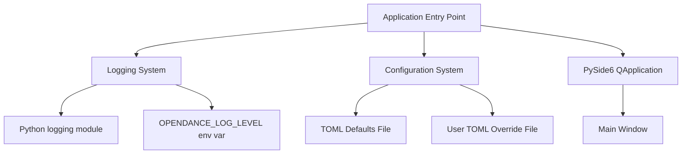
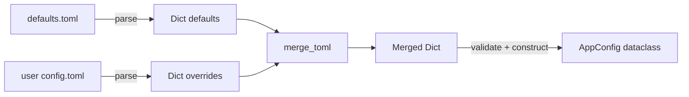

# Design Document: Project Foundation (Phase 0)

## Overview

This design document specifies the technical implementation of the OpenDance AI project foundation — the Phase 0 infrastructure that establishes the development skeleton. Phase 0 delivers:

- A well-defined Python project directory structure following the `src` layout
- A `pyproject.toml`-based package configuration with all dependencies declared
- A TOML-based configuration system with typed dataclass objects and merge semantics
- A structured logging system using Python's standard `logging` module
- A minimal PySide6 application entry point (main window with title and minimum size)
- A pytest-based test infrastructure with coverage support
- A GitHub Actions CI/CD pipeline (lint, type check, test)
- A README documenting setup, usage, and project structure
- Code quality tooling configuration (ruff, mypy)
- Git configuration (.gitignore)
- MIT License

Phase 0 explicitly does NOT implement any domain logic (camera, pose, motion, scoring, alignment, analytics, video processing, ML inference, Practice mode, or Arcade mode).

**Primary target platform:** Windows 10/11 x64. The architecture remains portable where practical.

## Architecture

### High-Level Structure

```
OpenDance AI (Phase 0)
├── Package Layer (pyproject.toml, setuptools, src layout)
├── Configuration Layer (TOML loading, dataclass models, merge logic)
├── Logging Layer (standard logging, env-driven level, ISO 8601 format)
├── Application Layer (PySide6 QApplication, main window, event loop)
├── Test Layer (pytest, pytest-cov, unit/integration structure)
├── CI Layer (GitHub Actions workflow)
└── Tooling Layer (ruff, mypy, .gitignore, LICENSE, README)
```

### Dependency Flow



### Initialization Order

The application entry point initializes systems in this strict order:
1. **Logging System** — configured first so all subsequent operations can log
2. **Configuration System** — loaded after logging so config errors are logged
3. **PySide6 QApplication** — created after config is available
4. **Main Window** — created and displayed last, starting the event loop

### Package Layout

```
repository-root/
├── src/
│   └── opendance/
│       ├── __init__.py          # Package root, exposes __version__ = "0.1.0"
│       ├── logging_setup.py     # Logging configuration (cross-cutting infrastructure)
│       ├── app/
│       │   ├── __init__.py
│       │   └── main.py          # Entry point: main() function
│       ├── ui/
│       │   └── __init__.py
│       ├── camera/
│       │   └── __init__.py
│       ├── video/
│       │   └── __init__.py
│       ├── pose/
│       │   └── __init__.py
│       ├── motion/
│       │   └── __init__.py
│       ├── alignment/
│       │   └── __init__.py
│       ├── scoring/
│       │   └── __init__.py
│       ├── analytics/
│       │   └── __init__.py
│       ├── storage/
│       │   └── __init__.py
│       └── config/
│           ├── __init__.py
│           ├── loader.py        # TOML loading and merge logic
│           ├── models.py        # Dataclass configuration models
│           └── defaults.toml    # Bundled default configuration
├── tests/
│   ├── unit/
│   │   ├── test_config.py      # Configuration system tests
│   │   └── test_logging.py     # Logging system tests
│   ├── integration/
│   └── fixtures/
├── assets/
│   ├── models/
│   └── demo/
├── scripts/
├── .github/
│   └── workflows/
│       └── ci.yml
├── pyproject.toml
├── README.md
├── LICENSE
└── .gitignore
```

**Design decision — logging module location:** The logging system is placed at `src/opendance/logging_setup.py` (package root level) rather than inside `src/opendance/app/`. Logging is a cross-cutting infrastructure concern used by all subpackages. Placing it at the package root avoids a circular dependency where non-app subpackages (e.g., `config`) would need to import from `app`, which is the application layer. Any subpackage can import via `from opendance.logging_setup import get_logger`.

## Components and Interfaces

### 1. Configuration System (`src/opendance/config/`)

#### `models.py` — Configuration Dataclasses

```python
from dataclasses import dataclass, field


@dataclass(frozen=True)
class ScoringThresholds:
    """Scoring event thresholds (percentage boundaries)."""
    perfect_min: float = 90.0
    great_min: float = 75.0
    ok_min: float = 50.0
    meh_min: float = 30.0
    # Below meh_min is MISS


@dataclass(frozen=True)
class ScoringWeights:
    """Weighted contribution of each similarity metric."""
    pose_similarity: float = 0.40
    angle_similarity: float = 0.25
    motion_similarity: float = 0.20
    timing_similarity: float = 0.15


@dataclass(frozen=True)
class AppConfig:
    """Top-level application configuration."""
    scoring_thresholds: ScoringThresholds = field(default_factory=ScoringThresholds)
    scoring_weights: ScoringWeights = field(default_factory=ScoringWeights)
```

**Design decision — frozen dataclasses:** All configuration models use `frozen=True` to ensure immutability after construction. If future phases require runtime configuration changes (e.g., user adjusts playback speed in UI), a new `AppConfig` instance should be constructed with the updated values rather than mutating the existing instance. This preserves thread safety and simplifies reasoning about configuration state.

#### `loader.py` — Configuration Loading and Merging

```python
import os
import sys
from pathlib import Path
from typing import Any

# TOML parsing: use stdlib tomllib on Python 3.11+, fall back to tomli on 3.10
if sys.version_info >= (3, 11):
    import tomllib
else:
    import tomli as tomllib


def load_config(defaults_path: Path | None = None, user_path: Path | None = None) -> AppConfig:
    """Load configuration by merging defaults with optional user overrides.

    1. Locate and parse bundled defaults.toml via importlib.resources
    2. Locate and parse user config.toml (if it exists)
    3. Deep-merge user overrides into defaults
    4. Validate merged values (type and range)
    5. Construct and return AppConfig dataclass
    """
    ...


def get_user_config_path() -> Path:
    """Return platform-appropriate user config file path.

    Primary target (Windows): %APPDATA%\\opendance\\config.toml
    Fallback (non-Windows):   ~/.config/opendance/config.toml
    """
    ...


def merge_toml(defaults: dict, overrides: dict) -> dict:
    """Deep-merge override dict into defaults dict (override wins per-key)."""
    ...


def validate_value(key: str, value: Any, expected_type: type, valid_range: tuple | None = None) -> Any:
    """Validate a config value's type and range, returning default on failure.

    Validation ranges:
    - Scoring thresholds: 0.0 through 100.0 inclusive
    - Scoring weights: 0.0 through 1.0 inclusive

    Weight-sum validation is NOT performed in Phase 0; individual weights
    are stored as provided if they pass per-value range checks.
    """
    ...
```

**Design decision — TOML parsing compatibility:** Python 3.11 introduced `tomllib` in the standard library. Since the project supports Python >= 3.10, the loader conditionally imports `tomli` (a backport with identical API) on Python 3.10. The conditional dependency is declared in pyproject.toml as `tomli; python_version < "3.11"`.

**Design decision — config path resolution:** The user configuration path is determined by a small isolated implementation that does not require external dependencies:

- **Windows (primary target):** Reads the `APPDATA` environment variable (`os.environ.get("APPDATA")`). The config path is `%APPDATA%\opendance\config.toml`.
- **Non-Windows fallback:** Uses `~/.config/opendance/config.toml` via `Path.home() / ".config" / "opendance" / "config.toml"`.

This avoids introducing the `platformdirs` dependency. The logic is approximately 10 lines of code and is sufficient for the primary Windows target with a reasonable POSIX fallback.

#### `defaults.toml` — Bundled Defaults

```toml
[scoring.thresholds]
perfect_min = 90.0
great_min = 75.0
ok_min = 50.0
meh_min = 30.0

[scoring.weights]
pose_similarity = 0.40
angle_similarity = 0.25
motion_similarity = 0.20
timing_similarity = 0.15
```

**Design decision — defaults file discovery:** The `defaults.toml` file is discovered at runtime using `importlib.resources` (available since Python 3.9). This ensures correct loading whether the package is installed in editable mode, as a wheel, or in a zip archive. The `pyproject.toml` includes `[tool.setuptools.package-data]` with `opendance.config = ["defaults.toml"]` to ensure the file is included in built distributions.

### 2. Logging System (`src/opendance/logging_setup.py`)

```python
import logging
import os
import sys


LOG_FORMAT = "%(asctime)s [%(levelname)s] %(name)s: %(message)s"
LOG_DATE_FORMAT = "%Y-%m-%dT%H:%M:%S%z"
ENV_VAR = "OPENDANCE_LOG_LEVEL"
VALID_LEVELS = {"DEBUG", "INFO", "WARNING", "ERROR", "CRITICAL"}


def setup_logging() -> None:
    """Configure root logger with ISO 8601 timestamps, stderr output, and env-driven level."""
    ...


def get_logger(name: str) -> logging.Logger:
    """Return a named logger instance. Subpackages call this with __name__."""
    ...
```

**Behavior:**
- Reads `OPENDANCE_LOG_LEVEL` environment variable (case-insensitive)
- Falls back to INFO if unset or invalid (emits warning on invalid)
- Formats: `2024-01-15T10:30:00+0000 [INFO] opendance.config.loader: Loading defaults`
- Outputs to stderr via `StreamHandler(sys.stderr)`

### 3. Application Entry Point (`src/opendance/app/main.py`)

```python
import sys

from PySide6.QtWidgets import QApplication, QMainWindow


def main() -> int:
    """Application entry point. Returns exit code."""
    ...


if __name__ == "__main__":
    sys.exit(main())
```

**Behavior:**
1. Call `setup_logging()` — if it raises, write to stderr and continue with defaults
2. Call `load_config()` — if it raises, log error and continue with default `AppConfig()`
3. Create `QApplication(sys.argv)`
4. Create `QMainWindow`, set title "OpenDance AI", set minimum size 800×600
5. Show main window
6. Return `app.exec()` (starts Qt event loop)
7. If unhandled exception before event loop, log error and return non-zero exit code

### 4. Test Infrastructure

**Configuration in `pyproject.toml`:**

```toml
[tool.pytest.ini_options]
testpaths = ["tests"]
markers = [
    "integration: marks tests as integration tests",
]
```

**Test execution commands:**
- All tests: `pytest`
- Unit only: `pytest tests/unit/`
- Integration only: `pytest tests/integration/`
- With coverage: `pytest --cov=opendance --cov-report=term-missing`

### 5. CI/CD Pipeline (`.github/workflows/ci.yml`)

```yaml
name: CI
on:
  push:
    branches: [main]
  pull_request:
    branches: [main]

jobs:
  check:
    runs-on: ubuntu-latest
    strategy:
      matrix:
        python-version: ["3.10", "3.11"]
    env:
      QT_QPA_PLATFORM: offscreen
    steps:
      - uses: actions/checkout@v4
      - uses: actions/setup-python@v5
        with:
          python-version: ${{ matrix.python-version }}
      - run: pip install -e ".[dev]"
      - run: ruff check .
      - run: mypy src/
      - run: pytest --cov=opendance --cov-report=term-missing
```

**Execution order:** install → lint → type check → test

**Design decision — headless Qt testing:** The CI sets `QT_QPA_PLATFORM=offscreen` at the job level so that PySide6 `QApplication` can be instantiated without a display server. This allows application entry point tests to verify window creation and properties on headless Linux CI runners.

**Design decision — Windows path coverage via mocking:** The CI runs on `ubuntu-latest` only. Windows-specific behavior (such as `%APPDATA%`-based configuration path resolution) is verified by unit tests that mock `os.environ` and `sys.platform`. This provides reliable coverage without requiring a Windows CI runner in Phase 0.

### 6. Code Quality Tooling

**Package metadata and build configuration (`pyproject.toml`):**

```toml
[build-system]
requires = ["setuptools>=68.0"]
build-backend = "setuptools.build_meta"

[project]
name = "opendance"
version = "0.1.0"
requires-python = ">=3.10"
dependencies = [
    "PySide6>=6.5",
    "opencv-python>=4.8",
    "mediapipe>=0.10",
    "numpy>=1.24",
    "scipy>=1.10",
    "tomli>=2.0; python_version < '3.11'",
]

[project.optional-dependencies]
dev = [
    "pytest>=7.0",
    "pytest-cov>=4.0",
    "ruff>=0.1",
    "mypy>=1.0",
]

[project.scripts]
opendance = "opendance.app.main:main"

[tool.setuptools.packages.find]
where = ["src"]

[tool.setuptools.package-data]
"opendance.config" = ["defaults.toml"]
```

**Ruff configuration (`pyproject.toml`):**

```toml
[tool.ruff]
line-length = 100
exclude = [".venv", "venv", "build", "dist", "*.egg-info"]

[tool.ruff.lint]
select = ["F", "E", "W", "I"]

[tool.ruff.lint.isort]
known-first-party = ["opendance"]
```

**Mypy configuration (`pyproject.toml`):**

```toml
[tool.mypy]
packages = ["opendance"]
mypy_path = "src"
warn_return_any = true
warn_unused_configs = true
disallow_untyped_defs = true
ignore_missing_imports = true
```

`disallow_untyped_defs` is enabled globally but the checked scope is limited to `src/opendance` via `packages = ["opendance"]` and `mypy_path = "src"`. Test files are not checked by mypy unless explicitly added.

## Data Models

### Configuration Data Flow



### Configuration Model Hierarchy

```
AppConfig
├── ScoringThresholds
│   ├── perfect_min: float (90.0)
│   ├── great_min: float (75.0)
│   ├── ok_min: float (50.0)
│   └── meh_min: float (30.0)
└── ScoringWeights
    ├── pose_similarity: float (0.40)
    ├── angle_similarity: float (0.25)
    ├── motion_similarity: float (0.20)
    └── timing_similarity: float (0.15)
```

### User Config File Location

| Platform | Path | Mechanism |
|----------|------|-----------|
| Windows (primary) | `%APPDATA%\opendance\config.toml` | `os.environ.get("APPDATA")` |
| Non-Windows (fallback) | `~/.config/opendance/config.toml` | `Path.home() / ".config"` |

No external dependency is used for path resolution. The implementation is a small conditional block (~10 lines) inside `loader.py`.

### Merge Semantics

Given defaults:
```toml
[scoring.thresholds]
perfect_min = 90.0
great_min = 75.0
ok_min = 50.0
meh_min = 30.0
```

And user override:
```toml
[scoring.thresholds]
perfect_min = 95.0
```

Result: `perfect_min=95.0`, `great_min=75.0`, `ok_min=50.0`, `meh_min=30.0`

Only the explicitly specified key is overridden; all others retain their defaults.

## Error Handling

### Configuration System Errors

| Error Condition | Handling | User Impact |
|----------------|----------|-------------|
| User config file does not exist | Silently use defaults only | None — transparent |
| User config file is malformed TOML | Log warning, use all defaults | App works with defaults |
| Single value has wrong type | Log warning for that key, use default for that key | Other overrides still apply |
| Single value is out of range | Log warning for that key, use default for that key | Other overrides still apply |
| Defaults file missing (bundled) | Raise exception (programming error) | App entry point catches and uses hardcoded AppConfig() |

### Logging System Errors

| Error Condition | Handling | User Impact |
|----------------|----------|-------------|
| `OPENDANCE_LOG_LEVEL` not set | Default to INFO | None — expected behavior |
| `OPENDANCE_LOG_LEVEL` has invalid value | Default to INFO, emit warning via logging | Warning visible in logs |
| Logging setup raises exception | Entry point writes to stderr, continues | Logging may be less structured |

### Application Entry Point Errors

| Error Condition | Handling | User Impact |
|----------------|----------|-------------|
| Logging initialization fails | Write error to stderr, continue with Python defaults | App still starts |
| Configuration initialization fails | Log error, continue with default AppConfig() | App starts with defaults |
| Unhandled exception before event loop | Log error, exit with non-zero code | App fails to start, error in logs |
| No camera hardware present | No camera access attempted in Phase 0 | No impact |

### Design Rationale for Error Handling

The error handling strategy follows a "graceful degradation" principle:
- The application should always attempt to start, even with degraded configuration
- Errors in optional systems (user config, custom log level) should not prevent startup
- Only truly fatal errors (cannot create QApplication) should terminate the process
- All errors are logged for debugging, never silently swallowed

## Correctness Properties

Phase 0 does not define formal correctness properties. The infrastructure components delivered in this phase (configuration loading, logging setup, application entry point) are verified through deterministic example-based unit tests with known inputs and expected outputs. Property-based testing will be introduced in later phases when domain-specific algorithms (pose normalization, similarity calculations, temporal alignment, scoring) are implemented.

## Testing Strategy

### Testing Approach

Phase 0 uses conventional **pytest unit tests** to verify the configuration system, logging system, and application entry point behavior. Tests use deterministic inputs and explicit assertions.

Property-based testing is not used in Phase 0. The configuration and logging systems are straightforward infrastructure components where specific example-based tests with known inputs and expected outputs provide clear, maintainable coverage.

### Unit Test Plan

| Module | Test File | Coverage Areas |
|--------|-----------|----------------|
| Configuration system | `tests/unit/test_config.py` | Default loading, merge behavior, validation, error cases |
| Logging system | `tests/unit/test_logging.py` | Initialization, level handling, logger creation |
| Application entry | `tests/unit/test_main.py` | Init order, error handling, window properties |

### Configuration Tests (`tests/unit/test_config.py`)

Tests covering:

1. **Configuration defaults** — Loading defaults.toml produces an `AppConfig` with the expected threshold and weight values (PERFECT=90.0, GREAT=75.0, OK=50.0, MEH=30.0; pose_similarity=0.40, angle_similarity=0.25, motion_similarity=0.20, timing_similarity=0.15)
2. **Configuration merge behavior** — Partial user overrides merge correctly: overridden keys take user values, unspecified keys retain defaults
3. **Invalid configuration values** — Wrong types (e.g., string where float expected) and out-of-range values (e.g., threshold of 150.0 or weight of -0.5) fall back to the default for that key with a warning logged
4. **Validation ranges** — Threshold values outside 0.0–100.0 are rejected; weight values outside 0.0–1.0 are rejected; values at boundaries (0.0, 100.0, 1.0) are accepted
5. **Weight-sum not validated** — Individual weights that are valid per-value (e.g., all set to 0.90) are accepted even though their sum exceeds 1.0
6. **Malformed TOML** — Unparseable TOML in the user config file results in all defaults being used with a warning logged
7. **Missing user config** — When no user config file exists, defaults load without error
8. **User config path resolution** — `get_user_config_path()` returns a `Path` ending in `opendance/config.toml` using `APPDATA` on Windows or `~/.config` as fallback. Tests use mocked `os.environ` and `sys.platform` to cover both platforms on any CI runner.

### Logging Tests (`tests/unit/test_logging.py`)

Tests covering:

1. **Logging initialization** — `setup_logging()` completes without raising an exception
2. **Log level handling** — Valid `OPENDANCE_LOG_LEVEL` values (DEBUG, INFO, WARNING, ERROR, CRITICAL, case-insensitive) set the correct level on the root logger
3. **Invalid log level** — An invalid `OPENDANCE_LOG_LEVEL` value results in INFO level and a warning is emitted
4. **Missing log level** — When `OPENDANCE_LOG_LEVEL` is not set, the root logger defaults to INFO
5. **Logger creation** — `get_logger(__name__)` returns a `logging.Logger` instance with the expected name
6. **Log format** — Formatted output contains ISO 8601 timestamp, level name, logger name, and message

### Application Entry Point Tests (`tests/unit/test_main.py`)

Tests covering:

1. **Startup behavior** — `main()` calls `setup_logging()` before `load_config()`, and both before creating UI components
2. **Configuration failure resilience** — If `load_config()` raises, `main()` continues with default `AppConfig()`
3. **Logging failure resilience** — If `setup_logging()` raises, `main()` writes to stderr and continues
4. **Window properties** — The main window has title "OpenDance AI" and minimum size 800×600

Application entry point tests require `QT_QPA_PLATFORM=offscreen` to instantiate `QApplication` without a display server. This is set at the CI job level and should be documented for local headless execution.

### Test Dependencies

The `[project.optional-dependencies]` dev group includes only:
- `pytest` — test runner
- `pytest-cov` — coverage reporting
- `ruff` — linting
- `mypy` — type checking

No additional test dependencies are required.

### Test Execution Commands

```bash
# Run all tests
pytest

# Run unit tests only
pytest tests/unit/

# Run integration tests only
pytest tests/integration/

# Run with coverage
pytest --cov=opendance --cov-report=term-missing
```

### What Phase 0 Tests Verify

1. Configuration system loads defaults correctly (thresholds + weights match bundled TOML)
2. Configuration merge logic handles partial override combinations
3. Configuration validation rejects invalid values gracefully
4. Malformed TOML in user config falls back to defaults
5. Logging system initializes without exception and returns usable loggers
6. Log level environment variable handling (valid, invalid, missing)
7. Log output format contains all required components
8. Application entry point initialization order (logging → config → UI)
9. Application entry point error handling (config failure, logging failure)

### What Phase 0 Tests Do NOT Cover

- Camera, video, pose, motion, alignment, scoring, analytics, storage logic (not implemented)
- End-to-end UI interaction tests (deferred to later phases)
- Performance benchmarks (deferred per testing steering file)
- CI pipeline execution (verified by GitHub Actions itself)
